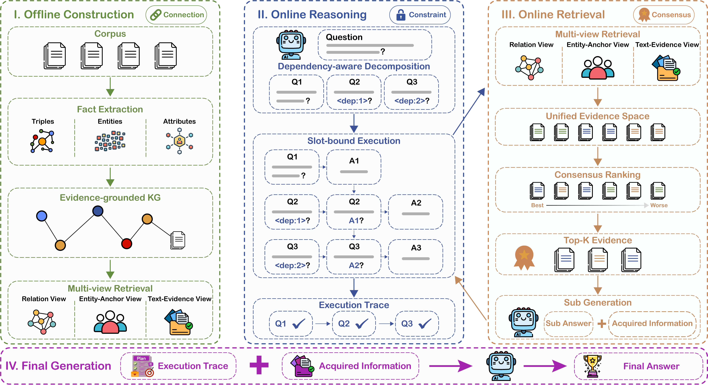

<h1 align="center">ConRAG: Consensus-Driven Multi-View Retrieval for Multi-Hop Question Answering</h1>

<p align="center">
  <a href="https://arxiv.org/abs/2605.28093" target="_blank">
    
  </a>
  <a href="https://github.com/yikai-zhu/ConRAG" target="_blank">
    
  </a>
</p>

This repository contains the implementation of ConRAG, a consensus-driven multi-view retrieval framework for multi-hop question answering. ConRAG improves both sides of retrieval-augmented generation: it builds an evidence-grounded graph on the corpus side, and it executes dependency-aware sub-questions on the query side. Retrieval is performed through multiple complementary views and fused in a unified evidence-unit space.

## 🎉 News

- **2026-05-28**: Released the ConRAG codebase.

## 🧩 Framework



ConRAG follows four stages:

- Offline construction: extracts triples, entities, and attributes from the corpus, then builds an evidence-grounded knowledge graph whose graph objects retain links to source passages.
- Online reasoning: decomposes the input question into dependency-aware sub-questions and executes them with slot-bound intermediate answers.
- Online retrieval: retrieves from relation, entity-anchor, and text-evidence views, maps all signals back to textual evidence units, and applies consensus ranking.
- Final generation: uses the execution trace and acquired information to produce the final answer.

The three core designs in the paper correspond to these stages:

- Connection grounds graph structures in verifiable evidence units.
- Constraint propagates intermediate answers as lightweight slot bindings for later retrieval steps.
- Consensus fuses relation, entity-anchor, and text-evidence signals within the same evidence-unit ranking space.

## ⚙️ Environment

Create a conda environment with Python 3.12.

```bash
conda create -n conrag python=3.12
conda activate conrag
python pip install -e .
```

## 🚀 Quick Start

Run the included example dataset with 10 passages and 3 questions:

```bash

python -u main.py \
  --dataset example
```

## 📁 Data Preparation

This repository includes a small example dataset under `datasets/example/`, containing 10 passages and 3 questions.

`corpus.json` is a list of passages with `title` and `text` fields. `questions.json` is a list of question records with at least `question` and `answer` fields.

## ▶️ Run

Run the pipeline from `main.py`:

```bash
python -u main.py --dataset <dataset_name>
```

Other configuration fields are defined in `src/conrag/config.py`.

## 📤 Outputs

The pipeline writes reusable knowledge-base artifacts to:

```text
outputs/<dataset_name>/
```

Each run writes prediction results, evaluation results, and logs to:

```text
results/<dataset_name>/<timestamp>/
```

The main result file is `results.json`; the aggregate score file is `evaluation_report.json`.

## 🗂️ Code Structure

```text
📦 .
│-- 📂 datasets
│   └── 📂 example                # Small example dataset with 10 passages and 3 questions
│       ├── corpus.json           # Example corpus passages
│       └── questions.json        # Example question records
│-- 📂 figures
│   └── framework.png             # Framework figure from the paper
│-- 📂 src/conrag
│   ├── 📂 prompts                # Prompt templates and extraction schema
│   │   ├── __init__.py
│   │   ├── prompt_templates.py   # Prompt templates for extraction, planning, answering, and evaluation
│   │   └── schema.json           # Entity, relation, and attribute schema
│   ├── __init__.py
│   ├── clients.py                # LLM and embedding clients
│   ├── common.py                 # Shared utilities for logging, JSON, text cleaning, and concurrency
│   ├── config.py                 # Runtime configuration
│   ├── evaluation.py             # String-based and LLM-based evaluation
│   ├── graph.py                  # Evidence-grounded graph construction
│   ├── pipeline.py               # End-to-end pipeline orchestration
│   ├── planning.py               # Question planning data structures and rendering helpers
│   ├── retrieval.py              # Multi-view consensus retrieval and slot-bound execution
│   └── vector_store.py           # FAISS indices for graph and text views
│-- 📜 main.py                    # Pipeline entry point
│-- 📜 pyproject.toml             # Project metadata and dependencies
│-- 📜 README.md
│-- 📜 LICENSE                    # License file
│-- 📜 .gitignore                 # Files to exclude from Git
```

## 📚 Citation

If you find this work helpful, please consider citing us:

```bibtex
@article{zhu2026conrag,
  title={ConRAG: Consensus-Driven Multi-View Retrieval for Multi-Hop Question Answering},
  author={Zhu, Yikai and Chen, Kunfeng and Zhong, Qihuang and Liu, Juhua and Du, Bo},
  journal={arXiv preprint arXiv:2605.28093},
  year={2026},
}
```
